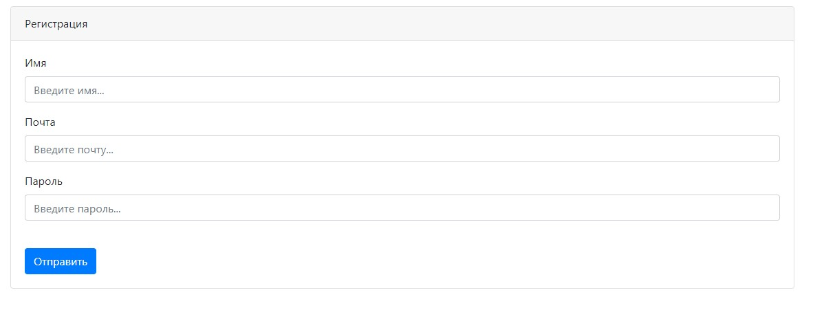
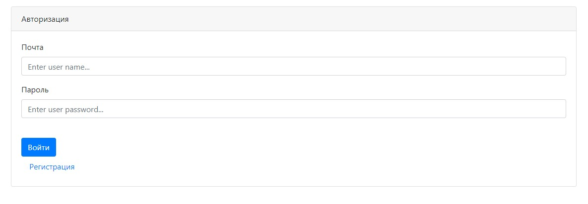
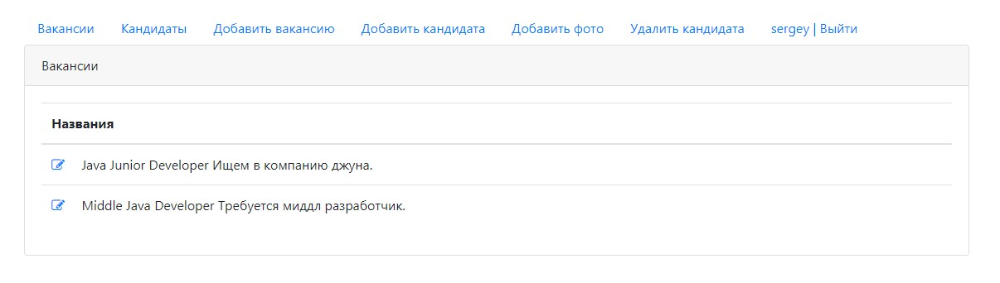
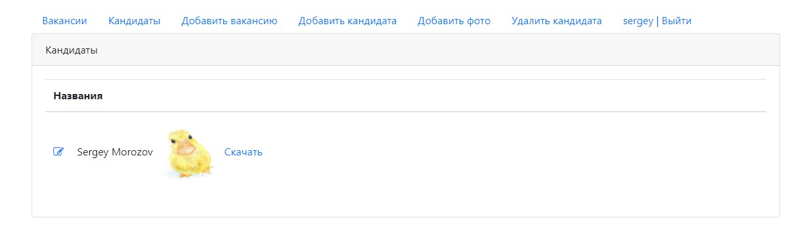
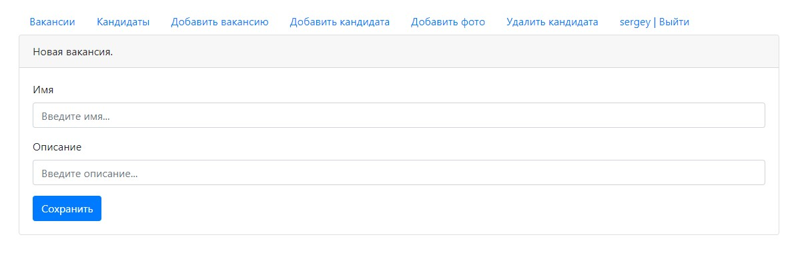
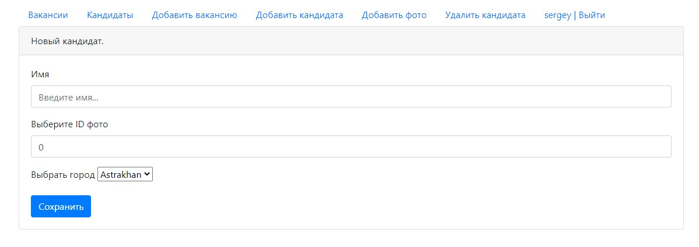
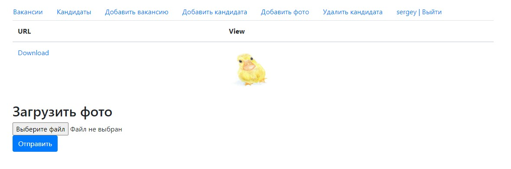
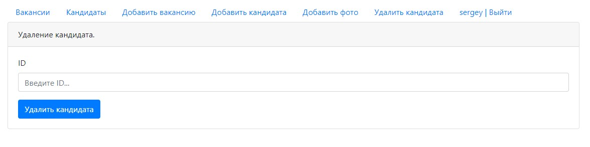

# Dream Job

##### Инструменты использованые в проекте:

- ***Servlet/JSP***
- ***JDBC/PostgreSQL***
- ***Maven***
- ***Apache Tomcat***
- ***JUnit/Mockito***
- ***JaCoCo***
- ***Travis CI***
- ***Git***

## О проекте.

Учебный проект представляет собой площадку для размещения вакансий и кандидатов. Перед использованием
требуется **зарегистрироваться** и **авторизоваться** в системе. После авторизации предоставляется 
доступ ко всем частям площадки, таким как: **просмотр существующих вакансий и кандидатов, добавление 
и редактирование вакансии, добавление и редактирование кандидата, загрузка и скачивание фотографий.**

- Страница регистрации на площадке.

- Страница авторизации на площадке.

- Страница просмотра вакансий.

- Страница просмотра кандидатов.

- Страница добавления и редактирования вакансий.

- Страница добавления и редактирования кандидатов.

- Страница добавления и скачивания фото.

- Страница удаления кандидата.

## Контакты.

***email:*** morozov.java.job@gmail.com